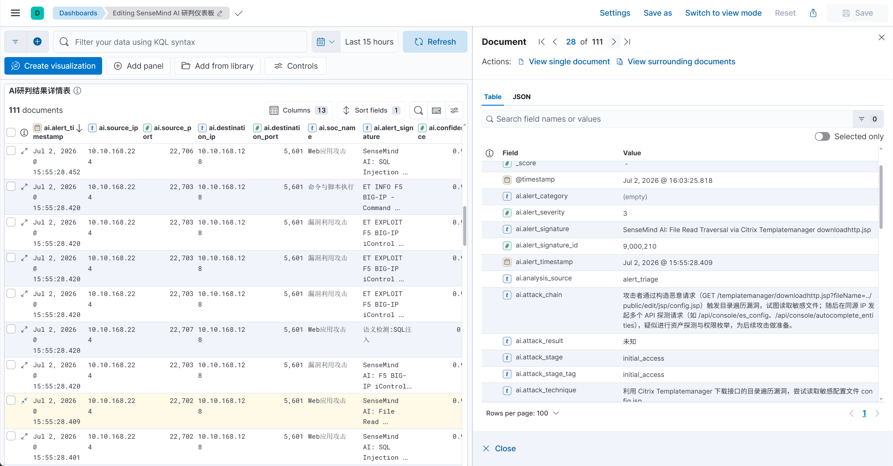
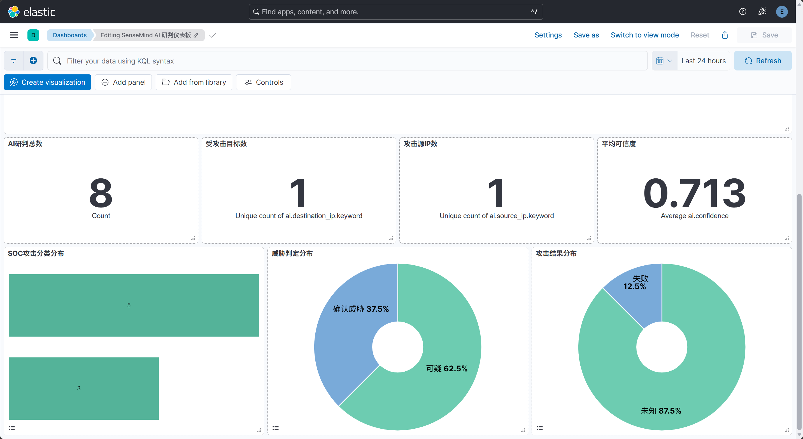

<p align="center"></p>

<h1 align="center">SenseMind</h1>

<p align="center">一个以 AI 为核心的轻量级 SOC 平台。自动从未命中攻击日志中挖掘低误报检测规则，通过持续积累检测规则实现自我进化，生生不息</p>

<hr>

## 特性

- **双探针流量采集**：Suricata（告警/事件 + payload）与 Zeek（协议元数据）并行运行，Community ID 跨探针关联。
- **Elastic 全栈一体化**：Filebeat → Logstash（字段裁剪 + ECS 转换 + SOC 分类）→ Elasticsearch → SenseMind Web 可视化。
- **SOC 14 大类分类**：Logstash 实时匹配 Suricata 告警，映射 MITRE ATT&CK 战术阶段，命中重点告警自动推送 AI。
- **6 阶段 AI 研判**：标准化 → 研判 → 动态关联查询 → RAG 知识增强 → 最终分析 → 规则生成，AI 自主决策，结构化输出。
- **三层联合查询**：Community ID 精确关联（同会话全量日志，跨 Suricata + Zeek 探针）+ 源/目的 IP 时间窗口关联（覆盖多连接、横向移动）+ IP 历史告警查询（24h），结果去重合并。
- **类语义检测引擎**：关键词匹配（13 类攻击特征）+ 递归解码（5 层 URL/HTML/Base64/Hex）+ 语法分析（SQL 注释清除、Shell 命令解析、路径规范化、XSS 标签检测），零 LLM 调用捕获编码绕过和变形攻击。
- **AI 自学习闭环**：确认攻击后自动生成 Suricata 规则写入 `local.rules` 并热加载，采用 HTTP sticky buffer 精确匹配 + 动态地址组，持续积累检测能力。
- **告警去重**：同一 `community_id` + `signature_id` 在时间窗口内只分析一次。
- **一键部署**：证书生成、密码引导、规则更新、全栈启动全流程自动化。

> **规划中**：接入客户端日志（syslog / Beats / 自定义推送），将主机层告警与网络流量关联，为 AI 研判提供更丰富的上下文，提升检测精度。

## 快速开始

### 环境要求

- Docker Engine + Docker Compose V2
- `curl`、`jq`、`unzip`、`openssl`、`ethtool`

### 部署

#### LLM 配置

编辑 `ai-analyzer/config.yaml`：支持 OpenAI、Ollama、vLLM 等 OpenAI 兼容后端。

```yaml
llm:
  api_key: "sk-xxx"
  base_url: "https://..."   # OpenAI 兼容接口
  model: "glm-5.2"          # 如果部署后需要修改模型执行: docker restart ai-analyzer
  temperature: 0.1
  max_tokens: 4000
  timeout: 60
```

#### 威胁情报配置（可选）

默认关闭，不影响部署。如需启用 IP/域名威胁情报查询，编辑 `ai-analyzer/config.yaml`：

```yaml
threat_intel:
  enabled: true                                        # 开启查询
  api_url: "http://10.0.0.1:8080/api/query?type={type}&value={value}"  # 接口地址，{type} 为 ip/domain，{value} 为查询值
  api_key: "your-api-key"                              # API Key，留空则不传
  api_key_in: "header"                                 # Key 传递方式: header 或 query
  api_key_name: "x-apikey"                             # Key 的 header/参数名
  timeout: 10                                          # 请求超时（秒）
  jq_filter: ""                                        # 响应字段提取（jq 语法），留空返回原始 JSON
```

> 必须显式设置 `enabled: true` 且 `api_url` 非空才会启用查询，默认关闭不产生任何请求。修改后执行 `docker restart ai-analyzer` 生效。


```bash
sudo bash deploy.sh <interface>   # 如 ens192、eth0
```

### 访问

| 服务 | 地址 | 凭据 |
|------|------|------|
| SenseMind | `http://<IP>:8080` | `admin` / `.env` 中的 `ELASTIC_PASSWORD` |


```bash
cat .env | grep ELASTIC_PASSWORD
```





## 架构

```
   ┌───>Suricata eve.json / Zeek logs
   │               │
   │               │
   │    Filebeat (等待 Logstash 就绪)
   │               │
   │         Logstash 主管道
   规   字段裁剪 / ECS 转换 / SOC 分类
   则              │
   生         ┌────┴────┐
   成         │         │
   │       全量→ES   matched→AI推送管道
   │       soc-*       │
   │             AI 分析中心 (6阶段 Chain)
   └──────────────结果回写 ES (soc-ai-*)
                       │
                  SenseMind Web 可视化
```

## 目录结构

```
SenseMind/
├── deploy.sh                    # 一键部署脚本
├── remove.sh                    # 彻底清理脚本
├── docker-compose.yml           # 全栈编排
├── certs/                       # ES SSL 证书（自动生成）
├── filebeat/filebeat.yml        # 采集配置
├── logstash/
│   ├── logstash.conf            # 主管道
│   ├── ai-push.conf             # AI 推送管道
│   └── soc_categories.json      # SOC 分类映射
├── ai-analyzer/
│   ├── config.yaml              # LLM/ES/知识库/Suricata/去重 配置
│   ├── knowledge/               # RAG 知识库（MITRE + SOC Playbook）
│   └── app/                     # FastAPI + LangChain 6阶段 Chain
└── web/                         # Vue 3 前端（监控中心/分析中心/日志中心/系统设置）
```
`ai-analyzer/knowledge`仅有基础RAG知识，需对其进行维护提高检测准确性

## SOC 分类

| 分类 | MITRE | 覆盖 |
|------|-------|------|
| 01 Web应用攻击 | T1190 | SQL注入/XSS/RCE/文件上传 |
| 02 身份认证攻击 | T1110 | 暴力破解/弱口令/撞库 |
| 03 扫描探测 | T1046 | 端口扫描/漏洞扫描器 |
| 04 漏洞利用 | T1068 | Log4j/Struts2/Fastjson |
| 05 恶意通信C2 | T1071 | 木马/Beacon/DGA/Cobalt Strike |
| 06 横向移动 | T1021 | SMB/RDP/PsExec |
| 07 数据泄露 | T1041 | 异常上传/数据外传 |
| 08 隧道通信 | T1572 | DNS隧道/ICMP隧道 |
| 09 DDoS | T1498 | SYN Flood/HTTP Flood |
| 10 主机攻击 | T1055 | 提权/凭据窃取 |
| 11 命令执行 | T1059 | PowerShell/Shell/宏 |
| 12 LOLBin | T1218 | certutil/bitsadmin/mshta |
| 13 信息泄露 | T1552 | .git/.env/源码泄露 |
| 14 恶意文件 | T1204 | 木马/勒索/RAT |

## 常用操作

```bash
# 更新 Suricata 规则
sudo docker exec --user suricata suricata suricata-update -f

# 热加载规则
sudo docker exec suricata suricatasc -c reload-rules

# 查看 AI 生成的规则
cat /data/suricata/lib/rules/local.rules

# 重启 AI 分析中心（修改 config.yaml 后）
docker restart ai-analyzer

# 手动触发某条告警分析
curl -X POST http://localhost:9090/api/analyze/<doc_id>
```

### 故障恢复

#### 查看当前WEB白名单
sudo docker exec sensemind-postgres psql -U postgres -d sensemind \
  -c "SELECT allowed_login_ips FROM system_config WHERE id=1;"

#### 清空WEB白名单（允许所有 IP 访问）
sudo docker exec sensemind-postgres psql -U postgres -d sensemind \
  -c "UPDATE system_config SET allowed_login_ips='' WHERE id=1;"

#### 或修改WEB为正确的 IP
sudo docker exec sensemind-postgres psql -U postgres -d sensemind \
  -c "UPDATE system_config SET allowed_login_ips='IP地址' WHERE id=1;"


无法登录前端时，可通过命令行直接操作。以下命令中 `sensemind-postgres` 和 `ai-analyzer` 为默认容器名。

#### 查看用户状态

```bash
docker exec -it sensemind-postgres psql -U postgres -d sensemind -c \
  "SELECT id, username, role, is_active, (totp_secret_encrypted IS NOT NULL) AS totp_enabled, failed_login_attempts, auth_mode, last_login_at FROM users;"
```

#### 重置用户密码

将 `newpassword` 替换为你要设置的密码：

```bash
docker exec -i ai-analyzer python << 'EOF'
from app.core.auth import hash_password
from app.core.database import SessionLocal
from app.db_models.user import User
from sqlalchemy import update
h = hash_password('newpassword')
with SessionLocal() as db:
    result = db.execute(update(User).where(User.username=='admin').values(password_hash=h))
    db.commit()
    print(f'密码已重置，影响行数: {result.rowcount}')
EOF
```

#### 解锁被禁用的账号

登录连续失败达到限制（默认 5 次）后账号会被自动禁用：

```bash
docker exec -it sensemind-postgres psql -U postgres -d sensemind -c \
  "UPDATE users SET failed_login_attempts=0, is_active=true WHERE username='admin';"
```

#### 一键重置（密码 + 解锁 + 禁用 TOTP）

最常见的场景——忘记密码 + 账号被锁 + TOTP 丢失，一条命令全部搞定，密码重置为 `admin123`：

```bash
docker exec -i ai-analyzer python << 'EOF'
from app.core.auth import hash_password
from app.core.database import SessionLocal
from app.db_models.user import User
from sqlalchemy import update
h = hash_password('admin123')
with SessionLocal() as db:
    result = db.execute(update(User).where(User.username=='admin').values(
        password_hash=h, failed_login_attempts=0, is_active=True,
        totp_secret_encrypted=None, auth_mode='PASSWORD_ONLY'
    ))
    db.commit()
    print(f'已重置 admin 用户，影响行数: {result.rowcount}')
EOF
```

#### 禁用 TOTP / 切换为纯密码模式

如果用户被设为 TOTP-only 或密码+TOTP 模式后丢失 TOTP 设备，可清除 TOTP 密钥并切回纯密码模式：

```bash
docker exec -it sensemind-postgres psql -U postgres -d sensemind -c \
  "UPDATE users SET totp_secret_encrypted=null, auth_mode='PASSWORD_ONLY' WHERE username='admin';"
```

#### 创建新管理员

当所有管理员账号都无法恢复时，可直接创建一个新的（密码为 `admin123`）：

```bash
docker exec -i ai-analyzer python << 'EOF'
from app.core.auth import hash_password
from app.core.database import SessionLocal
from app.db_models.user import User
from sqlalchemy import select
h = hash_password('admin123')
with SessionLocal() as db:
    existing = db.execute(select(User).where(User.username=='newadmin')).scalar_one_or_none()
    if existing:
        print('用户 newadmin 已存在')
    else:
        db.add(User(
            username='newadmin', password_hash=h, role='admin',
            auth_mode='PASSWORD_ONLY', is_active=True, failed_login_attempts=0
        ))
        db.commit()
        print('已创建管理员 newadmin，密码: admin123')
EOF
```

#### 启用/禁用用户

手动启用被禁用的用户：

```bash
docker exec -it sensemind-postgres psql -U postgres -d sensemind -c \
  "UPDATE users SET is_active=true WHERE username='admin';"
```

手动禁用用户：

```bash
docker exec -it sensemind-postgres psql -U postgres -d sensemind -c \
  "UPDATE users SET is_active=false WHERE username='test';"
```

## 彻底清理

```bash
sudo bash remove.sh
```

清理容器、网络、数据卷、本地数据与证书（不删除已下载镜像）。

## 技术栈

| 组件 | 版本 |
|------|------|
| Elasticsearch / Logstash / Filebeat | 8.19.16 |
| Suricata / Zeek | latest |
| AI 分析中心 | Python 3.12 + LangChain + FastAPI |
| Web 前端 | Vue 3 + TypeScript + Pinia + Element Plus |
| 数据存储 | PostgreSQL 16 + Redis 7 |

## 贡献

欢迎提交Issue/PR