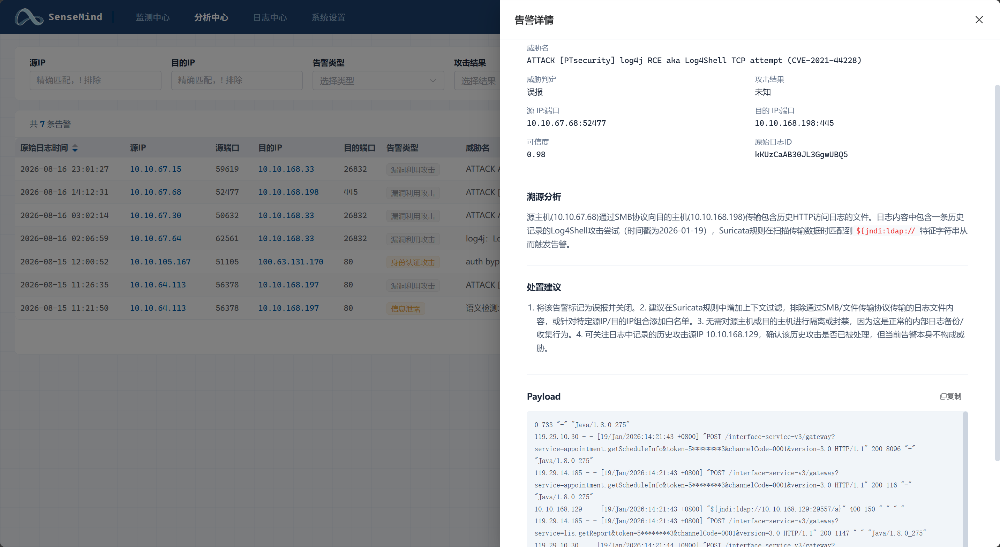
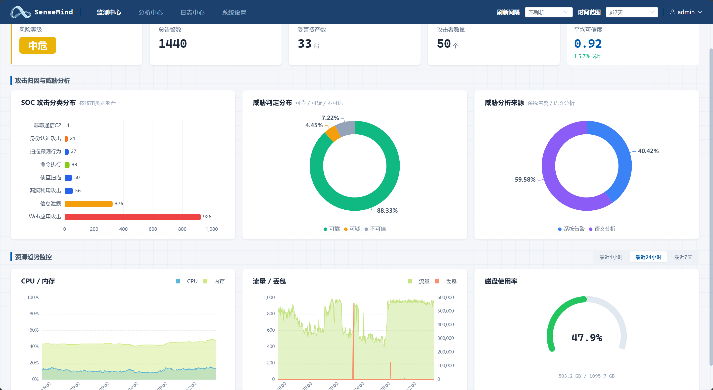

<p align="center"></p>

<h1 align="center">SenseMind</h1>

<p align="center"><strong>An AI-centric lightweight SOC platform</strong><br>
It mines low-false-positive detection rules out of attacks that raised no alert, and keeps evolving as those rules accumulate.</p>

<p align="center">
  
  
  
  
  
  
</p>

<p align="center">
  <a href="README.md"><b>简体中文</b></a> | <b>English</b>
</p>

---

An open-source detection stack (Suricata + ELK) deployed by a small or mid-sized security team usually runs into the same situation: hundreds to thousands of alerts a day, most of them false positives, and sustained manual follow-up is not realistic. Detection content depends on external rule sets, which cover little of the attacks that actually reach the local environment, while commercial SOC platforms are priced well beyond what such a team can budget. When a real intrusion does occur, the alert has often already fired — nobody saw it.

SenseMind targets that specific gap. Alerts go to AI triage first, and once an attack is confirmed, the system generates a low-false-positive detection rule for it and hot-reloads that rule, so the same class of attack is detected automatically from then on. Detection capability does not depend on external rule sets; it accumulates from the attacks observed in local traffic. The system runs on production traffic today, and the rules in its rule pool are generated and retained by the system itself rather than written by hand one at a time.

## How it works

The core is a closed loop: **an alert enters AI triage; if the attack is confirmed, a rule is generated and hot-reloaded, and detection capability accumulates with it.**

1. **Traffic collection**: Suricata emits alerts and payloads, Zeek emits protocol metadata, and the two are correlated through Community ID.
2. **Tagging and dispatch**: Logstash tags alerts with the 14 SOC categories and maps them to MITRE ATT&CK tactics; alerts that fall into key categories are pushed to the AI Analysis Center automatically.
3. **AI triage**: five stages run in sequence — normalization → triage → dynamic correlation queries → RAG knowledge augmentation → verdict. Correlation covers three dimensions (exact Community ID correlation, source/destination IP time-window correlation, and 24-hour alert history), reconstructing the full chain of an attack across Suricata and Zeek.
4. **Rule generation and loading**: once an attack is confirmed, the AI generates the corresponding Suricata rule (precise HTTP sticky-buffer matching plus dynamic address groups), writes it into the rule pool and hot-reloads it. No engine restart is required.
5. **Rule retention**: only low-false-positive rules are kept, so detection capability keeps accumulating.

Examples of locally generated rules:

```suricata
alert tcp any any -> any any (msg:"log4j：Log4Shell JNDI LDAP 注入远程代码执行漏洞利用"; flow:established,to_server; content:"${jndi:ldap://"; nocase; sid:93134; rev:1;)

alert http any any -> any any (msg:"auth bypass：Swagger UI API 文档未授权访问探测"; flow:established,to_server; http.uri; content:"swagger-ui"; nocase; sid:93152; rev:2;)
```

Beyond alerts matched by rules, SenseMind also provides a **semantic detection engine**: keyword matching + 5-layer recursive decoding (URL / HTML / Base64 / Hex) + syntax analysis (SQL comment stripping, shell command parsing, path normalization, XSS tag detection). The engine makes no LLM calls; it catches encoded bypasses and obfuscated attacks.

<p align="center">
  
  <br><sub>AI triage detail: attack confirmation, pivot analysis, remediation advice, highlighted payload matches</sub>
</p>

<p align="center">
  
  <br><sub>Monitoring dashboard: SOC attack categories, verdict distribution, detection sources</sub>
</p>

### What it does not do

- It does not collect host logs. syslog / Beats ingestion is planned; today it covers network traffic only.
- It does not produce compliance reports and does not consume external threat-intelligence feeds — detection capability comes from rules distilled from its own traffic.
- It does not chase full feature parity with commercial SIEM products; it focuses on alert triage and rule accumulation.

## Getting started

### Requirements

- Docker Engine + Docker Compose V2
- `curl`, `jq`, `unzip`, `openssl`, `ethtool`
- A Linux host able to receive the traffic to be inspected. **The capture interface must be connected to a SPAN port, an optical splitter, or a network TAP.**

### Reference configuration (10 Gbps internal mirrored traffic)

The configuration below comes from a production deployment and can be used as a sizing reference.

| Item | Configuration | Measured usage |
|------|---------------|----------------|
| CPU | Intel Xeon Silver 4210R (40 threads) | about 13.4% on average (peak 23.9%) |
| Memory | 62 GiB | about 41.1% on average (about 26 GB; peak 47.0%) |
| System disk | 1.1 TB (single `sda`, LVM volume group `ubuntu-vg`) | 49% used, of which the Elasticsearch volume takes about 367 GB |
| Capture NIC | 10 Gb full duplex | — |

Disk usage is dominated by raw logs (7-day default retention). It can be reduced by lowering **raw log retention days** under Settings.

Related parameters: Suricata runs af-packet with 16 threads and memcap values of flow 2 GiB / stream 4 GiB / reassembly 8 GiB; Elasticsearch uses `-Xms2g -Xmx2g` and Logstash `-Xms4g -Xmx4g` (set in `docker-compose.yml`).

### Deployment

```bash
git clone https://github.com/monstertsl/SenseMind.git
cd SenseMind
sudo bash deploy.sh <interface>   # capture interface, e.g. eno1np0, ns192
```

`deploy.sh` configures the NIC, generates certificates, bootstraps the password, updates rules and starts the full stack. The first run pulls images, so it takes as long as the network allows.

### Sign-in

| Service | URL | Credentials |
|---------|-----|-------------|
| SenseMind | `https://<IP>:8080` | `admin` / `ELASTIC_PASSWORD` from `.env` |

```bash
cat .env | grep ELASTIC_PASSWORD
```

### Ports

| Port | Purpose | Exposure |
|------|---------|----------|
| 8080 | Web console (HTTPS) | all interfaces |
| 5044 | Logstash Beats input | all interfaces |
| 9090 | AI Analysis Center API | 127.0.0.1 only |
| 9200 | Elasticsearch | 127.0.0.1 only |
| 5432 | PostgreSQL | 127.0.0.1 only |

Only 8080 needs to be reachable externally; open 5044 only when external Filebeat shippers must connect.

### LLM configuration

```
Settings > Integrations > LLM model
```

Any OpenAI-compatible endpoint works (vLLM / DashScope included).

## Architecture

```
                                       ┌───>Suricata eve.json / Zeek logs
                                       │               │
                                       │    Filebeat (waits for Logstash readiness)
                                       │               │
                                       │         Logstash main pipeline
                                       │    field trimming / ECS mapping / SOC tagging
                                       │               │
                                       │          ┌────┴────┐
                                       │          │         │
                                       │      all→ES    matched→AI push pipeline
                                       │      soc-*         │
                                       │             AI Analysis Center (5-stage chain)
                                       └───< rule generation
                                                       │
                                           results written back to ES (soc-ai-*)
                                                       │
                                                  SenseMind web console
```

## The 14 SOC categories

| Category | MITRE | Coverage |
|----------|-------|----------|
| 01 Web application attacks | T1190 | SQL injection / XSS / RCE / file upload |
| 02 Authentication attacks | T1110 | brute force / weak credentials / credential stuffing |
| 03 Scanning and probing | T1046 | port scans / vulnerability scanners |
| 04 Exploit attempts | T1068 | Log4j / Struts2 / Fastjson |
| 05 Malicious C2 traffic | T1071 | trojans / beacons / DGA / Cobalt Strike |
| 06 Lateral movement | T1021 | SMB / RDP / PsExec |
| 07 Data exfiltration | T1041 | anomalous uploads / outbound data transfer |
| 08 Tunneling | T1572 | DNS tunneling / ICMP tunneling |
| 09 DDoS | T1498 | SYN flood / HTTP flood |
| 10 Host attacks | T1055 | privilege escalation / credential theft |
| 11 Command execution | T1059 | PowerShell / shell / macros |
| 12 LOLBins | T1218 | certutil / bitsadmin / mshta |
| 13 Information disclosure | T1552 | .git / .env / source-code exposure |
| 14 Malicious files | T1204 | trojans / ransomware / RATs |

## Project structure

```
SenseMind/
├── deploy.sh                    # one-command deployment script
├── remove.sh                    # full cleanup script
├── docker-compose.yml           # full-stack orchestration
├── certs/                       # ES SSL certificates (generated)
├── filebeat/filebeat.yml        # collection configuration
├── logstash/
│   ├── logstash.conf            # main pipeline
│   ├── ai-push.conf             # AI push pipeline
│   └── soc_categories.json      # SOC category mapping
├── suricata/
│   ├── combined.rules           # custom rules
│   └── patch_yaml.py            # idempotent suricata.yaml patching script
├── scripts/
│   └── suri_monitor.py          # troubleshooting script: sampling monitor
├── ai-analyzer/
│   ├── config.yaml              # LLM / ES / knowledge base / Suricata / dedup config
│   ├── knowledge/               # RAG knowledge base (MITRE + SOC playbooks)
│   └── app/                     # FastAPI + LangChain 5-stage chain
└── web/                         # Vue 3 frontend (monitoring / analysis / logs / settings)
```

`ai-analyzer/knowledge` ships with a basic RAG knowledge base only; it needs maintenance to keep detection accuracy up.

## Tech stack

| Component | Version |
|-----------|---------|
| Elasticsearch / Logstash / Filebeat | 8.19.16 |
| Suricata / Zeek | latest |
| AI Analysis Center | Python 3.12 + LangChain + FastAPI |
| Web frontend | Vue 3 + TypeScript + Pinia + Element Plus |
| Data store | PostgreSQL 16 |

## Routine operations

```bash
# Update Suricata rules
sudo docker exec --user suricata suricata suricata-update -f

# Hot-reload rules
sudo docker exec suricata suricatasc -c reload-rules

# Inspect AI-generated rules
cat /data/suricata/lib/rules/local.rules

# Manually trigger analysis for a single alert
curl -X POST http://localhost:9090/api/v1/analyze/<doc_id>
```

### Sampling and troubleshooting

```bash
# -i specifies the capture interface (same as at deployment); samples once every 120s by default
sudo python3 scripts/suri_monitor.py -i eno1np0

# Custom interval and output directory (default /tmp/sensemind-monitor/)
sudo python3 scripts/suri_monitor.py -i eno1np0 60 /tmp/suri-mon
```

The output directory contains `suri_monitor.csv` and a same-named `.md` (directly viewable). A sampling interval of 60s or more is recommended.

## Common issues

The cases below can all be handled from the command line. `sensemind-postgres` and `ai-analyzer` are the default container names.

### Alerts are coming in, but the AI Analysis Center is empty

An alert's `msg` must match a category keyword in `logstash/soc_categories.json`; only then does it carry the `soc.matched` tag and get pushed to the AI Analysis Center. Keep this in mind when naming `msg` in custom rules.

### Show the current web allowlist

```bash
sudo docker exec sensemind-postgres psql -U postgres -d sensemind \
  -c "SELECT allowed_login_ips FROM system_config WHERE id=1;"
```

### Clear the web allowlist (allow all IP addresses)

```bash
sudo docker exec sensemind-postgres psql -U postgres -d sensemind \
  -c "UPDATE system_config SET allowed_login_ips='' WHERE id=1;"
```

### Set the web allowlist to the correct IP address

```bash
sudo docker exec sensemind-postgres psql -U postgres -d sensemind \
  -c "UPDATE system_config SET allowed_login_ips='IP地址' WHERE id=1;"
```

### Show user status

```bash
docker exec -it sensemind-postgres psql -U postgres -d sensemind -c \
  "SELECT id, username, role, is_active, (totp_secret_encrypted IS NOT NULL) AS totp_enabled, failed_login_attempts, auth_mode, last_login_at FROM users;"
```

### Reset a user password

Replace `newpassword` with the password you want to set:

```bash
docker exec -i ai-analyzer python << 'EOF'
from app.core.auth import hash_password
from app.core.database import SessionLocal
from app.db_models.user import User
from sqlalchemy import update
h = hash_password('newpassword')
with SessionLocal() as db:
    result = db.execute(update(User).where(User.username=='admin').values(password_hash=h))
    db.commit()
    print(f'密码已重置，影响行数: {result.rowcount}')
EOF
```

### Unlock a disabled account

An account is disabled automatically once failed sign-ins reach the limit (5 by default):

```bash
docker exec -it sensemind-postgres psql -U postgres -d sensemind -c \
  "UPDATE users SET failed_login_attempts=0, is_active=true WHERE username='admin';"
```

### One-shot reset (password + unlock + disable TOTP)

The most common situation — forgotten password, locked account and lost TOTP device — fixed with one command. The password is reset to `admin123`:

```bash
docker exec -i ai-analyzer python << 'EOF'
from app.core.auth import hash_password
from app.core.database import SessionLocal
from app.db_models.user import User
from sqlalchemy import update
h = hash_password('admin123')
with SessionLocal() as db:
    result = db.execute(update(User).where(User.username=='admin').values(
        password_hash=h, failed_login_attempts=0, is_active=True,
        totp_secret_encrypted=None, auth_mode='PASSWORD_ONLY'
    ))
    db.commit()
    print(f'已重置 admin 用户，影响行数: {result.rowcount}')
EOF
```

### Disable TOTP / switch to password-only mode

If an account is set to TOTP-only or password + TOTP and the TOTP device is lost, clear the TOTP secret and switch the account back to password-only mode:

```bash
docker exec -it sensemind-postgres psql -U postgres -d sensemind -c \
  "UPDATE users SET totp_secret_encrypted=null, auth_mode='PASSWORD_ONLY' WHERE username='admin';"
```

### Create a new administrator

When no administrator account can be recovered, create a new one (password `admin123`):

```bash
docker exec -i ai-analyzer python << 'EOF'
from app.core.auth import hash_password
from app.core.database import SessionLocal
from app.db_models.user import User
from sqlalchemy import select
h = hash_password('admin123')
with SessionLocal() as db:
    existing = db.execute(select(User).where(User.username=='newadmin')).scalar_one_or_none()
    if existing:
        print('用户 newadmin 已存在')
    else:
        db.add(User(
            username='newadmin', password_hash=h, role='admin',
            auth_mode='PASSWORD_ONLY', is_active=True, failed_login_attempts=0
        ))
        db.commit()
        print('已创建管理员 newadmin，密码: admin123')
EOF
```

### Enable / disable a user

```bash
# Enable a disabled user manually
docker exec -it sensemind-postgres psql -U postgres -d sensemind -c \
  "UPDATE users SET is_active=true WHERE username='admin';"

# Disable a user manually
docker exec -it sensemind-postgres psql -U postgres -d sensemind -c \
  "UPDATE users SET is_active=false WHERE username='test';"
```

## Full cleanup

```bash
sudo bash remove.sh
```

Removes containers, networks, data volumes, local data and certificates (downloaded images are kept).

## Contributing

Issues and pull requests are welcome. When reporting a problem, include your deployment method, capture interface type (SPAN / TAP), Suricata version and the relevant logs so it can be reproduced.

## License

This project is released under the MIT License. See [LICENSE](LICENSE) for details.
